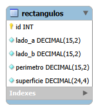

# Ejercicio 1: API de rectángulos

API REST con Express y MySQL para administrar rectángulos. Para cada rectángulo se guardan sus dos lados, su perímetro y su superficie.

## Cómo ejecutarlo

1. Instalar dependencias: `npm install`
2. Copiar `.env.example` a `.env` y completar `DB_USER` y `DB_PASSWORD` (el `.env` no se sube al repositorio).
3. Crear el esquema y la tabla con el SQL de la sección "Modelo de datos".
4. Iniciar el servidor: `npm run dev`
5. Probar los métodos con el archivo `pruebas.http` (extensión REST Client de VS Code).

## Modelo de datos



```sql
CREATE SCHEMA IF NOT EXISTS tp2_ejercicio1;
USE tp2_ejercicio1;

CREATE TABLE rectangulos (
  id INT UNSIGNED NOT NULL AUTO_INCREMENT,
  lado_a DECIMAL(15,2) NOT NULL,
  lado_b DECIMAL(15,2) NOT NULL,
  perimetro DECIMAL(15,2) NOT NULL,
  superficie DECIMAL(24,4) NOT NULL,
  PRIMARY KEY (id)
);
```

Decisiones:

- **Una sola tabla:** el enunciado describe una única entidad, sin relaciones con otras, por lo que no hace falta más.
- **`id` autoincremental como clave primaria:** identifica cada rectángulo sin depender de sus valores, que pueden repetirse.
- **Columnas `DECIMAL` y no enteras:** los lados pueden tener fracciones, y `DECIMAL` evita los errores de redondeo de los tipos de punto flotante.
- **`superficie` con 4 decimales:** si los lados admiten 2 decimales, el producto de ambos puede tener hasta 4. Con 2 decimales se redondearía y el dato quedaría inconsistente.
- **Todas las columnas `NOT NULL`:** un rectángulo siempre tiene sus cuatro valores.
- **Perímetro y superficie se persisten** porque el enunciado lo pide, aunque podrían derivarse de los lados. Para que nunca queden desactualizados, solo los escribe el servidor y se recalculan en cada modificación.

## API

El recurso es `rectangulos`: un sustantivo en plural, y la acción la indica el método HTTP.

| Método | Ruta | Descripción | Respuestas |
|---|---|---|---|
| POST | `/rectangulos` | Crea un rectángulo a partir de sus lados | 201, 400 |
| GET | `/rectangulos` | Lista todos los rectángulos | 200 |
| GET | `/rectangulos/:id` | Devuelve un rectángulo | 200, 400, 404 |
| PUT | `/rectangulos/:id` | Reemplaza los lados y recalcula | 200, 400, 404 |
| DELETE | `/rectangulos/:id` | Elimina un rectángulo | 204, 400, 404 |

Decisiones:

- **Cálculo en el servidor:** el cliente envía solo `lado_a` y `lado_b`. El servidor calcula `perimetro = 2 * (lado_a + lado_b)` y `superficie = lado_a * lado_b` antes de guardar.
- **Rechazo de valores calculados:** si el cuerpo trae `perimetro` o `superficie`, la API responde `400` en lugar de ignorarlos, para que el error sea visible para quien la consume.
- **PUT y no PATCH:** el cliente envía el rectángulo completo (los dos lados), por lo que se aplican las mismas reglas que en el POST.
- **Códigos de estado:** `201` al crear; `204` al eliminar, porque no hay contenido que devolver; `404` cuando el `id` es válido pero no existe; `400` cuando los datos enviados no son válidos, para distinguir un error del cliente de un recurso inexistente.
- **Columnas explícitas en las consultas:** se evita `SELECT *` para que la respuesta no cambie sin querer si se modifica la tabla.
- **Consultas parametrizadas (`?`):** previenen inyección SQL.
- **Pool de conexiones:** reutiliza conexiones en lugar de abrir una por consulta.

## Validaciones (express-validator)

**Cuerpo (POST y PUT):**

- `lado_a` y `lado_b` son obligatorios.
- Deben ser números JSON, no texto.
- Deben ser mayores que cero y no superar 1.000.000.000.
- Admiten como máximo 2 decimales.
- `perimetro` y `superficie` no pueden enviarse.

**Parámetros:** `id` debe ser un entero positivo (GET por id, PUT y DELETE).

**Consultas:** los endpoints no reciben parámetros de consulta, por lo que no hay nada que validar en ese punto.

Los errores se devuelven con el mismo formato en todas las rutas (middleware `validar`), y un JSON mal formado también responde `400`.

## Pruebas

El archivo `pruebas.http` incluye casos válidos e inválidos para cada método.