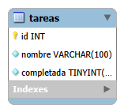

# Ejercicio 2: API de tareas

API REST con Express y MySQL para administrar una lista de tareas. Cada tarea tiene un nombre y un estado que indica si está completada. No puede haber dos tareas con el mismo nombre.

## Cómo ejecutarlo

1. Instalar dependencias: `npm install`
2. Copiar `.env.example` a `.env` y completar `DB_USER` y `DB_PASSWORD` (el `.env` no se sube al repositorio).
3. Crear el esquema y la tabla con el SQL de la sección "Modelo de datos".
4. Iniciar el servidor: `npm run dev`
5. Probar los métodos con el archivo `pruebas.http` (extensión REST Client de VS Code).

## Modelo de datos



```sql
CREATE SCHEMA IF NOT EXISTS tp2_ejercicio2
  DEFAULT CHARACTER SET utf8mb4
  COLLATE utf8mb4_0900_ai_ci;
USE tp2_ejercicio2;

CREATE TABLE tareas (
  id INT UNSIGNED NOT NULL AUTO_INCREMENT,
  nombre VARCHAR(100) CHARACTER SET utf8mb4 COLLATE utf8mb4_0900_ai_ci NOT NULL,
  completada BOOLEAN NOT NULL DEFAULT FALSE,
  PRIMARY KEY (id),
  UNIQUE KEY uq_tareas_nombre (nombre)
);
```

Decisiones:

- **Una sola tabla:** el enunciado describe una única entidad, sin relaciones con otras.
- **`id` autoincremental como clave primaria:** identifica cada tarea sin depender de su nombre, que el usuario puede cambiar.
- **`completada` booleana, por defecto `false`:** una tarea nueva está pendiente. MySQL guarda los booleanos como 0 y 1, y el servidor los devuelve como `true` y `false`.
- **Índice `UNIQUE` sobre `nombre`:** la base misma impide los duplicados, incluso si dos solicitudes llegan al mismo tiempo.
- **Colación `utf8mb4_0900_ai_ci`:** hace que la comparación de nombres no distinga mayúsculas (`ci`) ni acentos (`ai`).

## Criterio de igualdad de nombres

Dos nombres se consideran iguales si, después de quitar los espacios del principio y del final y reducir los espacios repetidos del medio a uno solo, coinciden sin distinguir mayúsculas de minúsculas ni acentos. Por ejemplo, `Comprar pan`, `  COMPRAR    pan ` y `Comprár pan` son la misma tarea.

Se aplica en dos capas:

1. **Servidor:** normaliza el nombre y valida que no exista otra tarea igual. Si existe, responde `409`.
2. **Base de datos:** el índice `UNIQUE` con la colación indicada actúa como respaldo si hay solicitudes simultáneas.

En el PUT, la comprobación excluye la propia tarea que se modifica; de lo contrario no se podría cambiar solo el estado de una tarea sin tocar su nombre. Al eliminar una tarea, su nombre queda disponible.

## API

El recurso es `tareas`: un sustantivo en plural, y la acción la indica el método HTTP.

| Método | Ruta | Descripción | Respuestas |
|---|---|---|---|
| POST | `/tareas` | Crea una tarea (el estado es opcional y por defecto `false`) | 201, 400, 409 |
| GET | `/tareas` | Lista las tareas, con filtro opcional `?estado=` | 200, 400 |
| GET | `/tareas/:id` | Devuelve una tarea | 200, 400, 404 |
| PUT | `/tareas/:id` | Reemplaza nombre y estado | 200, 400, 404, 409 |
| DELETE | `/tareas/:id` | Elimina una tarea | 204, 400, 404 |

Decisiones:

- **Filtro como parámetro de consulta:** `GET /tareas?estado=completadas` o `?estado=pendientes`. Filtrar no define otro recurso, sino otra forma de ver la misma colección. Sin el parámetro se listan todas.
- **Valores de filtro cerrados:** cualquier valor distinto de `completadas` o `pendientes` devuelve `400`, para que un error de tipeo no devuelva sin aviso la lista completa.
- **`409 Conflict` para nombres repetidos:** el dato es válido en sí mismo, pero choca con el estado actual de los datos. `400` se reserva para datos mal formados.
- **PUT y no PATCH:** reemplaza la tarea completa, por lo que exige nombre y estado.
- **`404` y `400` distintos:** `400` si el `id` no es válido y `404` si es válido pero no existe.
- **`204` al eliminar:** no hay contenido que devolver.
- **Consultas parametrizadas (`?`):** previenen inyección SQL.
- **Pool de conexiones:** reutiliza conexiones en lugar de abrir una por consulta.

## Validaciones (express-validator)

**Cuerpo (POST y PUT):**

- `nombre`: obligatorio, texto, no vacío después de normalizarlo, hasta 100 caracteres y único según el criterio anterior.
- `completada`: debe ser el booleano JSON `true` o `false` (no se aceptan textos ni números). Es opcional en el POST y obligatorio en el PUT.

**Parámetros:** `id` debe ser un entero positivo (GET por id, PUT y DELETE).

**Consultas:** `estado` es opcional y solo admite `completadas` o `pendientes`.

Los errores se devuelven con el mismo formato en todas las rutas (middleware `validar`), y un JSON mal formado también responde `400`.

## Pruebas

El archivo `pruebas.http` incluye casos válidos e inválidos para cada método, entre ellos nombres repetidos con otras mayúsculas, espacios y acentos, y la modificación de una tarea con su propio nombre.