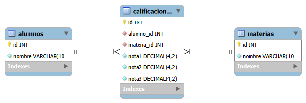

# Ejercicio 3: Calificaciones

API REST desarrollada con ExpressJS y MySQL para gestionar alumnos, materias y las calificaciones de cada alumno en cada materia. Cada calificación guarda exactamente tres notas.

## Cómo ejecutarlo

1. Requisitos: Node.js 24 y MySQL 8.0.
2. Crear la base de datos y las tablas ejecutando el script SQL de la sección "Modelo de datos".
3. Instalar las dependencias:

```
   npm install
```

4. Copiar `.env.example` como `.env` y completar `DB_USER` y `DB_PASSWORD`. El `.env` no se sube al repositorio. En `.env.example` el puerto de MySQL (`DB_PORT`) está en 3307; ajustarlo al que use cada instalación (3306 por defecto).
5. Iniciar el servidor:

```
   npm start
```

   Para desarrollo, con reinicio automático al guardar: `npm run dev`. El servidor queda en `http://localhost:3000`.
6. Probar la API con el archivo `pruebas.http` (extensión REST Client de VS Code).

## Modelo de datos



Tres tablas en el esquema `tp2_ejercicio3`:

- `alumnos`: `id` y `nombre`.
- `materias`: `id` y `nombre`. Es la tabla independiente que pide el enunciado.
- `calificaciones`: `id`, `alumno_id` (clave foránea a `alumnos`), `materia_id` (clave foránea a `materias`), `nota1`, `nota2` y `nota3`.

```sql
CREATE DATABASE tp2_ejercicio3
  DEFAULT CHARACTER SET utf8mb4
  COLLATE utf8mb4_0900_ai_ci;

USE tp2_ejercicio3;

CREATE TABLE alumnos (
  id INT UNSIGNED NOT NULL AUTO_INCREMENT,
  nombre VARCHAR(100) NOT NULL,
  PRIMARY KEY (id),
  UNIQUE KEY uq_alumnos_nombre (nombre)
);

CREATE TABLE materias (
  id INT UNSIGNED NOT NULL AUTO_INCREMENT,
  nombre VARCHAR(100) NOT NULL,
  PRIMARY KEY (id),
  UNIQUE KEY uq_materias_nombre (nombre)
);

CREATE TABLE calificaciones (
  id INT UNSIGNED NOT NULL AUTO_INCREMENT,
  alumno_id INT UNSIGNED NOT NULL,
  materia_id INT UNSIGNED NOT NULL,
  nota1 DECIMAL(4,2) NOT NULL,
  nota2 DECIMAL(4,2) NOT NULL,
  nota3 DECIMAL(4,2) NOT NULL,
  PRIMARY KEY (id),
  UNIQUE KEY uq_calificaciones_alumno_materia (alumno_id, materia_id),
  CONSTRAINT fk_calificaciones_alumno
    FOREIGN KEY (alumno_id) REFERENCES alumnos (id)
    ON DELETE RESTRICT ON UPDATE CASCADE,
  CONSTRAINT fk_calificaciones_materia
    FOREIGN KEY (materia_id) REFERENCES materias (id)
    ON DELETE RESTRICT ON UPDATE CASCADE,
  CONSTRAINT chk_nota1 CHECK (nota1 BETWEEN 0 AND 10),
  CONSTRAINT chk_nota2 CHECK (nota2 BETWEEN 0 AND 10),
  CONSTRAINT chk_nota3 CHECK (nota3 BETWEEN 0 AND 10)
);
```

### Decisiones del modelo

- **Alumnos en su propia tabla.** El enunciado pide guardar "el nombre del alumno" y no exige una tabla aparte, pero se decidió separarla. Si el alumno fuera un texto suelto dentro de cada calificación, el mismo alumno podría escribirse de formas distintas y no habría un recurso `/alumnos` real. Con una tabla propia, la regla de unicidad se expresa con identificadores (`alumno_id`, `materia_id`) y no comparando textos.
- **Materias en tabla independiente con clave foránea**, como exige el enunciado.
- **Unicidad alumno-materia en dos capas.** El índice `UNIQUE (alumno_id, materia_id)` garantiza la regla en la base aunque falle cualquier otra capa, por ejemplo si dos pedidos llegan al mismo tiempo. Además, la API la verifica antes de escribir para responder con un mensaje claro (409), tanto al crear como al modificar. En la modificación no se considera duplicada la propia fila.
- **`ON DELETE RESTRICT`.** No se puede borrar un alumno o una materia que tenga calificaciones. Borrar notas en cascada y en silencio sería peligroso; la API responde 409 con un mensaje.
- **Nombres únicos de alumno y de materia.** El índice `UNIQUE` sobre `nombre`, con la colación `utf8mb4_0900_ai_ci`, hace que "Matemática" y "matematica" se consideren el mismo nombre (sin distinguir mayúsculas ni acentos). Limitación: no pueden existir dos alumnos con exactamente el mismo nombre. Se aceptó porque, si el alumno se identificara por un nombre repetible, se podría saltear la regla de un solo registro por alumno y materia.
- **`DECIMAL(4,2)` para las notas.** Guarda valores exactos hasta 99,99 con dos decimales, sin los errores de redondeo de los números flotantes.
- **`CHECK` entre 0 y 10.** Es una segunda defensa en la base: `DECIMAL(4,2)` por sí solo permitiría guardar, por ejemplo, un 50. La validación principal sigue siendo la de la API.
- **`INT UNSIGNED` en los identificadores.** Por eso los `id` se validan hasta 4294967295.
- **Esquema propio.** Cada ejercicio usa su esquema, así el diagrama de este ejercicio sale separado.

## Escala de notas

Cada nota es un número entre **0 y 10 (ambos incluidos), con hasta 2 decimales**. Se eligió esta escala por ser la habitual en la universidad y fácil de documentar, y los decimales permiten notas como 7,50. Las notas se envían como números JSON; un texto como `"8"` se rechaza. El enunciado no pide promedio ni condición de aprobación, por eso la API no los calcula.

## API

Los recursos van en español y en plural; la acción la indica el método HTTP. `PUT` reemplaza el recurso completo (se exigen todos los campos) y no se usa `PATCH`.

### Alumnos

| Método | Ruta | Descripción | Respuestas |
|---|---|---|---|
| GET | `/alumnos` | Lista los alumnos | 200 |
| GET | `/alumnos/:id` | Obtiene un alumno | 200, 400, 404 |
| POST | `/alumnos` | Crea un alumno | 201, 400, 409 |
| PUT | `/alumnos/:id` | Reemplaza un alumno | 200, 400, 404, 409 |
| DELETE | `/alumnos/:id` | Elimina un alumno | 204, 400, 404, 409 |

### Materias

| Método | Ruta | Descripción | Respuestas |
|---|---|---|---|
| GET | `/materias` | Lista las materias | 200 |
| GET | `/materias/:id` | Obtiene una materia | 200, 400, 404 |
| POST | `/materias` | Crea una materia | 201, 400, 409 |
| PUT | `/materias/:id` | Reemplaza una materia | 200, 400, 404, 409 |
| DELETE | `/materias/:id` | Elimina una materia | 204, 400, 404, 409 |

### Calificaciones

| Método | Ruta | Descripción | Respuestas |
|---|---|---|---|
| GET | `/calificaciones` | Lista las calificaciones; filtros opcionales `alumno_id` y `materia_id` | 200, 400 |
| GET | `/calificaciones/:id` | Obtiene una calificación | 200, 400, 404 |
| POST | `/calificaciones` | Crea una calificación | 201, 400, 404, 409 |
| PUT | `/calificaciones/:id` | Reemplaza una calificación | 200, 400, 404, 409 |
| DELETE | `/calificaciones/:id` | Elimina una calificación | 204, 400, y 404 |

Cuerpo de ejemplo para crear o modificar una calificación:

```json
{ "alumno_id": 1, "materia_id": 1, "notas": [7, 8.5, 6.25] }
```

Respuesta de ejemplo:

```json
{
  "id": 1,
  "alumno": { "id": 1, "nombre": "Ana Pérez" },
  "materia": { "id": 1, "nombre": "Programación IV" },
  "notas": [7, 8.5, 6.25]
}
```

Los errores de validación responden `{ "errores": [{ "campo": "...", "mensaje": "..." }] }`; el resto de los errores responden `{ "error": "..." }`.

### Decisiones de la API

- **Códigos de estado.** 201 al crear; 200 al leer y modificar; 204 al eliminar (sin cuerpo); 400 si los datos son inválidos; 404 si el identificador es válido pero el recurso no existe; 409 si el dato es válido pero choca con una regla de unicidad o con una relación existente.
- **Alumno o materia inexistente al registrar una calificación: 404.** El identificador tiene formato válido pero el recurso no existe, el mismo criterio que para un `id` de la URL. Si además hay otros errores en el mismo pedido (por ejemplo una nota inválida), responde 400.
- **Duplicado: 409.** Cuando el único problema es la combinación alumno-materia repetida (o un nombre repetido), la respuesta es 409 y no 400. Si el pedido tiene otros errores, responde 400.
- **Respaldo ante pedidos simultáneos.** Si dos pedidos llegan a la vez y el índice `UNIQUE` rechaza el segundo, el controlador también responde 409.
- **Tres notas en un arreglo (`notas`).** Se eligió el arreglo porque el enunciado exige "exactamente tres notas" y así esa regla se valida y se prueba de forma explícita (con menos o más de tres, la API responde 400). Internamente se guardan en tres columnas.
- **Respuestas de calificaciones con alumno y materia.** Se devuelven con su nombre (mediante `JOIN`) para que cada respuesta se entienda sin consultar otros recursos.
- **DELETE incluido.** El enunciado pide "gestionar" los datos; se implementó la baja de los tres recursos. Eliminar un alumno o una materia con calificaciones asociadas se rechaza con 409.
- **Filtros en el listado de calificaciones.** `alumno_id` y `materia_id` permiten consultar las notas de un alumno o de una materia sin traer todo.
- **Tipos estrictos.** Los identificadores y las notas deben ser números JSON; los textos se rechazan.

## Validaciones

Todas las entradas se validan con `express-validator` antes de llegar al controlador.

### Cuerpo

| Recurso | Campo | Regla |
|---|---|---|
| Alumnos | `nombre` | Obligatorio; texto; se normaliza (sin espacios al borde y con los espacios repetidos reducidos a uno); no vacío; hasta 100 caracteres; debe empezar con una letra y solo admite letras (con acentos y ñ), espacios, apóstrofes,